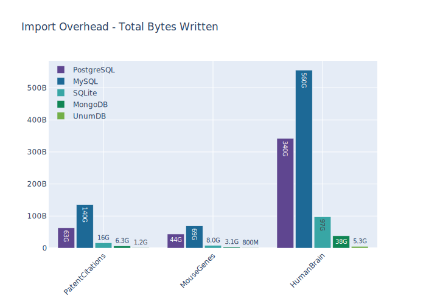
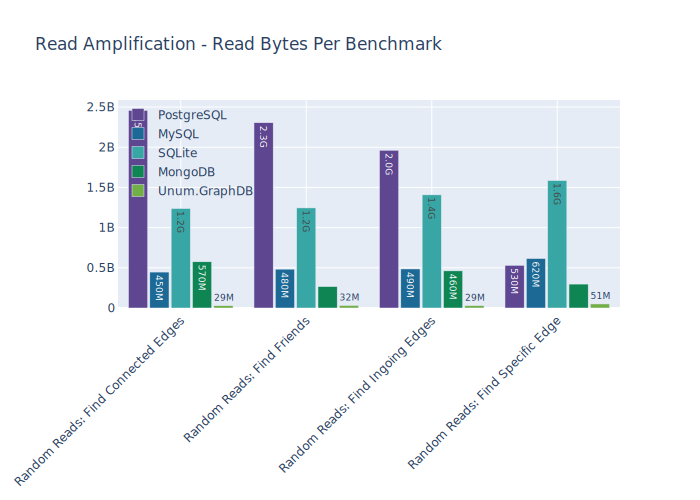
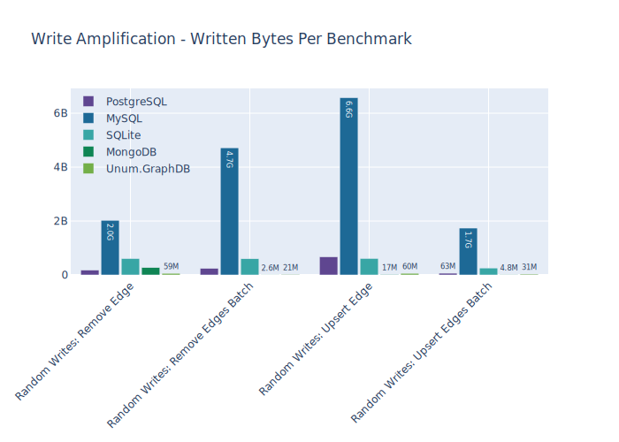

# How well can different DBs handle graphs (networks)?

At [Unum](https://unum.xyz) we develop a neuro-symbolic AI, which means combining discrete structural representations of data and semi-continuous neural representations.
The common misconception is that CPU/GPU power is the bottleneck for designing AGI, but we would argue that it's the storage layer (unless you want to train on the same data over and over again).

* CPU ⇌ RAM bandwidth ([DDR4](https://en.wikipedia.org/wiki/DDR4_SDRAM)): ~100 GB/s.
* GPU ⇌ VRAM bandwidth ([HBM2](https://en.wikipedia.org/wiki/High_Bandwidth_Memory)): ~1,000 GB/s.
* GPU ⇌ GPU bandwidth ([NVLink](https://en.wikipedia.org/wiki/NVLink)): ~300 GB/s.
* CPU ⇌ GPU bandwidth ([PCI-E Gen3 x16](https://en.wikipedia.org/wiki/PCI_Express)): ~15 GB/s (60 GB/s by 2022).
* CPU ⇌ SSD bandwidth ([NVMe over PCI-E Gen3 x4](https://en.wikipedia.org/wiki/NVM_Express)): ~2 GB/s (6 GB/s by 2022).

As we can see, the theoretical throughput between storage (SSD) and CPU is by far the biggest bottleneck.
2 GB/s isn't scary, but **most databases can hardly saturate 10% of that capacity (or 200 MB/s)** due to [read-amplification](http://smalldatum.blogspot.com/2015/11/read-write-space-amplification-pick-2_23.html) or random jumps.
That's why it's crucial for us to store the data in the most capable database!

## Setup

### Databases

* [SQLite](https://www.sqlite.org) is the most minimalistic SQL database. 
* [MySQL](https://www.mysql.com) is the most widely used Open-Source DB in the world. 
* [PostgreSQL](https://www.postgresql.org) is the 2nd most popular Open-Source DB.
* [MongoDB](https://www.sqlite.org/index.html) is the most popular NoSQL database. `$MDB` is values at aound $10 Bln.
* [Neo4J](https://neo4j.com) was designed specifically for graphs storage, but crashes consistently, so it was removed from comparison.
* [Unum.GraphDB](https://unum.xyz/db) is our in-house solution.

Databases were configured to use 512 MB of RAM for cache and 4 cores for query execution.
Links: [The Most Popular Open Source Databases 2020](https://www.percona.com/blog/2020/04/22/the-state-of-the-open-source-database-industry-in-2020-part-three/).

### Device

* CPU:
    * Model: `Intel(R) Core(TM) i9-9880H CPU @ 2.30GHz`.
    * Cores: 8 (16 threads @ 2.3 Ghz).
* RAM Space: 16.0 GB.
* Disk Space: 931.5 GB.
* OS Family: Darwin.
* Python Version: 3.7.7.

### Datasets

* [Patent Citation Network](http://networkrepository.com/cit-patent.php).
    * Size: 272 MB.
    * Edges: 16,518,947.
    * Average Degree: 8.
* [Mouse Gene Regulatory Network](http://networkrepository.com/bio-mouse-gene.php).
    * Size: 295 MB.
    * Edges: 14,506,199.
    * Average Degree: 670.
* [HumanBrain Network](http://networkrepository.com/bn-human-Jung2015-M87102575.php).
    * Size: 4 GB.
    * Edges: 87'273'967.
    * Average Degree: 186.

## Sequential Writes: Import CSV (edges/sec)

Every datascience project starts by importing the data.
Let's see how long it will take to load an adjacency list into each DB.
But before comparing DBs, let's see what our SSD is capable of by simply parsing the list (2 or 3 column CSV).
This will be our baseline for estimating the time required to build the indexes in each DB.

|                   | PatentCitations |  MouseGenes  |  HumanBrain  |   Gains    |
| :---------------- | :-------------: | :----------: | :----------: | :--------: |
| Parsing in Python |   276,762.85    |  269,444.25  |  242,972.78  |     1x     |
| Sampling in Unum  |  4,025,752.40   | 3,932,870.14 | 3,449,392.42 | **14.45x** |

Most DBs provide some form functionality for faster bulk imports, but not all of them where used in benchmarks for various reasons.

* Neo4J supports CSV imports, but it requires duplicating the imported file and constantly crashes (due to Java heap management issues).
* PostgreSQL and MySQL dialects of SQL have special functions for importing CSVs, but their functionality is very limited and performance gains aren't substantial. A better approach is to use unindexed table of incoming edges and later submit it into the main store once the data is absorbed. That's how we implemented it.
* MongoDB provides a command line tool, but it wasn't used to limit the number of binary dependencies and simplify configuration.

|              | PatentCitations |  MouseGenes  | HumanBrain |    Gains    |
| :----------- | :-------------: | :----------: | :--------: | :---------: |
| PostgreSQL   |    5,902.69     |   6,812.14   |  6,700.64  |     1x      |
| MySQL        |    11,889.85    |  16,095.21   | 10,807.24  |    2.00x    |
| SQLite       |    32,854.49    |  42,350.66   | 25,289.73  |    5.19x    |
| MongoDB      |    32,917.56    |  39,077.58   | 29,843.12  |    5.26x    |
| Unum.GraphDB |   253,298.95    | 1,056,780.56 | 819,382.93 | **106.78x** |

The benchmarks were repeated dozens of times. 
These numbers translate into following import duration for each dataset.

|              | PatentCitations  |    MouseGenes    |    HumanBrain    |
| :----------- | :--------------: | :--------------: | :--------------: |
| PostgreSQL   | 46 mins, 39 secs | 35 mins, 29 secs | 3 hours, 37 mins |
| MySQL        | 23 mins, 9 secs  | 15 mins, 1 secs  | 2 hours, 14 mins |
| SQLite       | 8 mins, 23 secs  | 5 mins, 43 secs  | 57 mins, 31 secs |
| MongoDB      | 8 mins, 22 secs  | 6 mins, 11 secs  | 48 mins, 44 secs |
| Unum.GraphDB |  1 mins, 5 secs  | 0 mins, 14 secs  | 1 mins, 47 secs  |

Those benchmarks only tell half of the story. 
SSDs have a relatively short lifespan, especially new high-capacity technologies like TLC and QLC. 
Most DBs don't have high-performance bulk I/O options. 
It means, that when you import the data there is no way to inform the DB about various properties of the imported dataset. 
Which in turn results in huge write-amplification. 
Combine this with inefficient and slow built-in compression and prepare to give all your money to AWS!

Once the data is imported, it's on-disk representation has different layouts in each DB. 
Some are more compact than others. For comparison, let's take the `HumanBrain` 4 GB graph. 
According to graph above, a total of 5.3 GB was writen during the import. 
However, thanks to our compression, the resulting DB size is only 0.8 GB. 
Same graph uses ~3.5 GB in MongoDB, ~15 GB in MySQL, ~15 GB in PostgreSQL and ~15 GB in SQLite.

## Read Queries

Following are simple lookup operations.
Their speed translates into the execution time of analytical queries like:

* Shortest Path Calculation,
* Clustering Analysis,
* Pattern Matching.

As we are running on a local machine and within the same filesystem,
the networking bandwidth and latency between server and client applications
can't be a bottleneck.

### Random Reads: Find Specific Edge

Input: 2 vertex identifiers (order is important). 
Output: edge that connects them in given direction. 
Metric: number of queries per second. 

|              | PatentCitations | MouseGenes | HumanBrain |    Gains    |
| :----------- | :-------------: | :--------: | :--------: | :---------: |
| PostgreSQL   |     530.98      |   210.12   |   333.01   |     1x      |
| MySQL        |     588.10      |   463.66   |   460.77   |    1.57x    |
| SQLite       |     501.45      |   336.20   |   20.13    |    0.87x    |
| MongoDB      |     615.85      |   101.44   |   57.60    |    0.61x    |
| Unum.GraphDB |    21,447.65    | 68,585.20  | 37,048.96  | **159.35x** |

### Random Reads: Find Connected Edges

Input: 1 vertex identifier. 
Output: all edges attached to it. 
Metric: number of queries per second. 

|              | PatentCitations | MouseGenes | HumanBrain |    Gains    |
| :----------- | :-------------: | :--------: | :--------: | :---------: |
| PostgreSQL   |     280.66      |    7.54    |   20.55    |     1x      |
| MySQL        |     411.96      |   33.03    |   81.64    |    3.27x    |
| SQLite       |     237.11      |   12.40    |   24.55    |    1.23x    |
| MongoDB      |     642.83      |   48.73    |   50.03    |    3.73x    |
| Unum.GraphDB |    33,426.60    |  8,809.77  | 16,543.26  | **697.31x** |

### Random Reads: Find Ingoing Edges

Input: 1 vertex identifier. 
Output: all edges incoming into it. 
Metric: number of queries per second. 

|              | PatentCitations | MouseGenes | HumanBrain |    Gains    |
| :----------- | :-------------: | :--------: | :--------: | :---------: |
| PostgreSQL   |     303.76      |   61.20    |   17.72    |     1x      |
| MySQL        |     522.43      |   71.84    |   128.35   |    3.38x    |
| SQLite       |     249.51      |   73.30    |   27.43    |    1.19x    |
| MongoDB      |     987.99      |   170.63   |   61.51    |    3.17x    |
| Unum.GraphDB |    33,748.78    | 11,677.90  | 20,017.27  | **477.19x** |

### Random Reads: Find Friends

Input: 1 vertex identifier. 
Output: the identifiers of all unique vertexes that share an edge with the input. 
Metric: number of queries per second. 

|              | PatentCitations | MouseGenes | HumanBrain |    Gains    |
| :----------- | :-------------: | :--------: | :--------: | :---------: |
| PostgreSQL   |     312.71      |   11.33    |   21.65    |     1x      |
| MySQL        |     427.02      |   32.53    |   77.54    |    2.61x    |
| SQLite       |     238.24      |   23.14    |   24.69    |    1.31x    |
| MongoDB      |     790.29      |   51.57    |   50.88    |    3.14x    |
| Unum.GraphDB |    45,616.00    | 10,306.82  | 21,258.48  | **679.06x** |

### Random Reads: Count Friends

Input: 1 vertex identifier. 
Output: the total number of attached edges and their accumulated weight. 
Metric: number of queries per second. 

|              | PatentCitations | MouseGenes | HumanBrain |    Gains    |
| :----------- | :-------------: | :--------: | :--------: | :---------: |
| PostgreSQL   |     333.80      |   69.38    |   27.22    |     1x      |
| MySQL        |     453.03      |    7.94    |   45.58    |    1.05x    |
| SQLite       |     276.89      |   166.34   |   32.69    |    1.48x    |
| MongoDB      |     972.77      |   107.47   |   66.58    |    2.30x    |
| Unum.GraphDB |    37,335.19    |  8,770.08  | 17,737.67  | **296.66x** |

### Random Reads: Count Followers

Input: 1 vertex identifier. 
Output: the total number of incoming edges and their accumulated weight. 
Metric: number of queries per second. 

|              | PatentCitations | MouseGenes | HumanBrain |    Gains    |
| :----------- | :-------------: | :--------: | :--------: | :---------: |
| PostgreSQL   |     384.53      |   523.76   |   28.28    |     1x      |
| MySQL        |     600.77      |   134.06   |   211.05   |    3.09x    |
| SQLite       |     295.23      |   364.06   |   34.20    |    0.89x    |
| MongoDB      |    1,451.90     |   547.85   |   81.04    |    2.56x    |
| Unum.GraphDB |    41,296.42    | 11,964.82  | 21,197.98  | **293.25x** |

## Write Operations

We don't benchmark edge insertions as those operations are uncommon in graph workloads.
Instead of that we benchmark **upserts** = inserts or updates.
Batch operations have different sizes for different DBs depending on memory consumption
and other limitations of each DB.
Concurrency is tested only in systems that explicitly support it.

### Random Writes: Upsert Edge

Input: 1 new edge. 
Output: success/failure indicator. 
Metric: number inserted edges per second. 

|              | PatentCitations | MouseGenes | HumanBrain |   Gains    |
| :----------- | :-------------: | :--------: | :--------: | :--------: |
| PostgreSQL   |     398.77      |   447.46   |   394.25   |     1x     |
| MySQL        |     295.08      |   382.02   |   262.42   |   0.75x    |
| SQLite       |     443.18      |   390.89   |   333.93   |   0.94x    |
| MongoDB      |    2,014.47     |  2,310.43  |  1,474.33  |   4.65x    |
| Unum.GraphDB |    6,746.84     |  6,025.57  |  5,589.32  | **14.85x** |

### Random Writes: Upsert Edges Batch

Input: 500 new edges. 
Output: 500 success/failure indicators. 
Metric: number inserted edges per second. 

|              | PatentCitations | MouseGenes | HumanBrain |   Gains    |
| :----------- | :-------------: | :--------: | :--------: | :--------: |
| PostgreSQL   |    1,922.62     |  2,088.48  |  2,503.27  |     1x     |
| MySQL        |    2,269.23     |  2,213.56  |  2,261.52  |   1.05x    |
| SQLite       |    3,758.68     |  3,317.96  |  3,626.23  |   1.66x    |
| MongoDB      |    5,211.36     |  4,634.20  |  3,440.20  |   2.10x    |
| Unum.GraphDB |    28,673.75    | 20,244.71  | 18,075.73  | **10.61x** |

### Random Writes: Remove Edge

Input: 1 existing edge. 
Output: success/failure indicator. 
Metric: number removed edges per second. 

|              | PatentCitations | MouseGenes | HumanBrain |   Gains   |
| :----------- | :-------------: | :--------: | :--------: | :-------: |
| PostgreSQL   |     845.35      |   964.71   |   679.98   |    1x     |
| MySQL        |     582.90      |   709.48   |   714.84   |   0.83x   |
| SQLite       |     358.19      |   401.46   |   303.40   |   0.43x   |
| MongoDB      |     688.57      |   863.73   |   481.64   |   0.81x   |
| Unum.GraphDB |    5,832.34     |  5,885.34  |  5,500.31  | **7.03x** |

### Random Writes: Remove Edges Batch

Input: 500 existing edges. 
Output: 500 success/failure indicators. 
Metric: number removed edges per second. 

|              | PatentCitations | MouseGenes | HumanBrain |   Gains    |
| :----------- | :-------------: | :--------: | :--------: | :--------: |
| PostgreSQL   |    1,188.46     |  1,343.77  |  1,126.29  |     1x     |
| MySQL        |     577.58      |   608.91   |   560.44   |   0.48x    |
| SQLite       |     581.98      |   594.95   |   605.30   |   0.49x    |
| MongoDB      |    8,792.92     |  8,393.00  |  5,165.72  |   6.08x    |
| Unum.GraphDB |    28,980.20    | 20,700.46  | 19,079.61  | **18.91x** |

