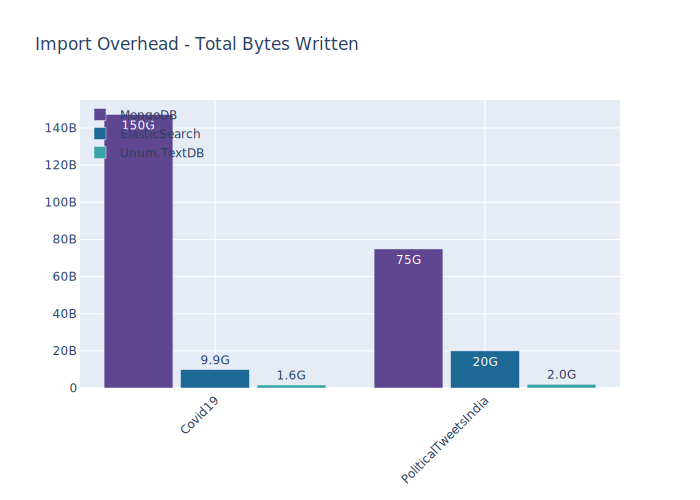
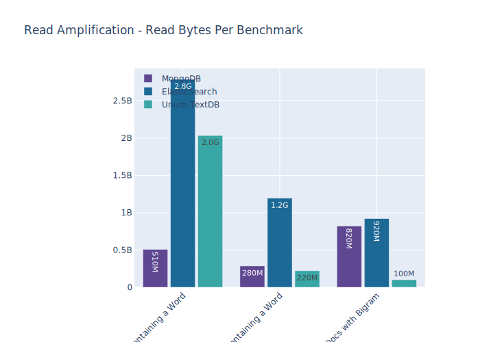
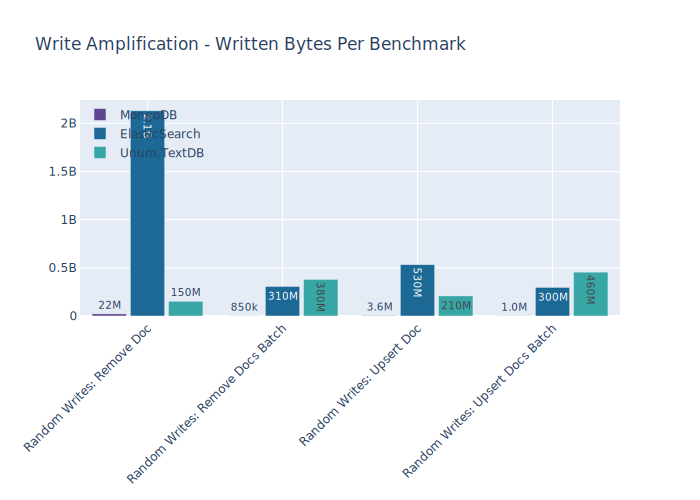

# How well can different DBs handle texts?

## Setup

### Databases

At [Unum](https://unum.am) we develop a neuro-symbolic AI, which means combining discrete structural representations of data and semi-continuous neural representations.
The common misconception is that CPU/GPU power is the bottleneck for designing AGI, but we would argue that it's the storage layer (unless you want to train on the same data over and over again).

* CPU ⇌ RAM bandwidth ([DDR4](https://en.wikipedia.org/wiki/DDR4_SDRAM)): ~100 GB/s.
* GPU ⇌ VRAM bandwidth ([HBM2](https://en.wikipedia.org/wiki/High_Bandwidth_Memory)): ~1,000 GB/s.
* GPU ⇌ GPU bandwidth ([NVLink](https://en.wikipedia.org/wiki/NVLink)): ~300 GB/s.
* CPU ⇌ GPU bandwidth ([PCI-E Gen3 x16](https://en.wikipedia.org/wiki/PCI_Express)): ~15 GB/s (60 GB/s by 2022).
* CPU ⇌ SSD bandwidth ([NVMe over PCI-E Gen3 x4](https://en.wikipedia.org/wiki/NVM_Express)): ~2 GB/s (6 GB/s by 2022).

As we can see, the theoretical throughput between storage (SSD) and CPU is by far the biggest bottleneck.
2 GB/s isn't scary, but **most databases can hardly saturate 10% of that capacity (or 200 MB/s)** due to [read-amplification](http://smalldatum.blogspot.com/2015/11/read-write-space-amplification-pick-2_23.html) or random jumps.
That's why it's crucial for us to store the data in the most capable database!

### Device

* CPU:
    * Model: `Intel(R) Core(TM) i9-9880H CPU @ 2.30GHz`.
    * Cores: 8 (16 threads @ 2.3 Ghz).
* RAM Space: 16.0 GB.
* Disk Space: 931.5 GB.
* OS Family: Darwin.
* Python Version: 3.7.7.

### Datasets

* [Covid19](https://www.kaggle.com/allen-institute-for-ai/CORD-19-research-challenge) Scientific Papers.
    * Documents: 45,941.
    * Sections: 1,604,649.
    * Size: 1,7 GB.
* [PoliticalTweetsIndia](https://www.kaggle.com/iamyoginth/facthub) Posts.
    * Documents: 12,488,144.
    * Sections: 12,488,144.
    * Size: 2,3 GB.
* [EnglishWikipedia](https://www.kaggle.com/jkkphys/english-wikipedia-articles-20170820-sqlite) Dump from 2017.
    * Documents: 4,902,648.
    * Sections: 23,046,187.
    * Size: 18,2 GB.

## Sequential Writes: Import CSV (docs/sec)

Every datascience project starts by importing the data.
Let's see how long it will take to load every dataset into each DB.

|               |  Covid19   | PoliticalTweetsIndia |    Gains    |
| :------------ | :--------: | :------------------: | :---------: |
| MongoDB       |   398.40   |       3,301.61       |     1x      |
| ElasticSearch |  5,915.53  |      10,262.29       |    8.98x    |
| UnumDB        | 142,575.07 |      930,285.22      | **319.82x** |

|               |     Covid19     | PoliticalTweetsIndia |
| :------------ | :-------------: | :------------------: |
| MongoDB       | 1 hours, 7 mins |   50 mins, 29 secs   |
| ElasticSearch | 4 mins, 31 secs |   16 mins, 14 secs   |
| UnumDB        | 0 mins, 11 secs |   0 mins, 13 secs    |

Those benchmarks only tell half of the story. 
We should not only consider performance, but also the used disk space and the affect on the hardware lifetime, as SSDs don't last too long.
Unum has not only the highest performance, but also the most compact representation.
MongoDB generally performs well across different benchmarks, but it failed to import the English Wikipedia in 10 hours.
I suspect a bug in the implementation of the text index, as some batch import operations took over 10 mins for a modest batch size of 10,000 docs.

|               | Covid19 | PoliticalTweetsIndia | EnglishWikipedia |
| :------------ | :-----: | :------------------: | :--------------: |
| MongoDB       | 1,9 GB  |        3,2 GB        | Expected 60,7 GB |
| ElasticSearch | 2,5 GB  |        2,9 GB        |     33,5 GB      |
| UnumDB        |    1    |          1           |        1         |

## Read Queries

Regular Expressions are the most computational intesive operations in textual database.
If the pattern is complex, even the most advanced DBs may not be able to utilize the pre-constructed search index.
As a result they will be forced to run a full-scan against all documents stored in the DB.
It means having at least 2 bottlenecks:

1. If you are scanning all the data in the DB you are limited by the sequential read performance of the SSD (accounting for the read amplification dependant on the data locality).
2. The speed of your RegEx engine.

The (1.) point is pretty clear, but the (2.) is much more complex. Most DBs use the [PCRE/PCRE2](http://www.pcre.org) C library which was first released back in 1997 with a major upgrade in 2015.
Implementing full RegEx support is complex, especially if you want to beat C code in performance, so most programming languages and libraries just wrap PCRE.
That said, the performance is still laughable. It varies a lot between different different queries, but [can be orders of magniture slower](https://rust-leipzig.github.io/regex/2017/03/28/comparison-of-regex-engines/) than [Intel Hyperscan](https://software.intel.com/content/www/us/en/develop/articles/introduction-to-hyperscan.html) State-of-theArt library.
Most (if not all) of those libraries use the classical DFA-based algorithm with `~O(n)` worst case time complexity for search (assuming the automata is already constructed).
As always, we are not limiting ourselves to using existing algorithms, we design our own. In `Unum.ReGex` we have developed an algorithm with worst-case-complexity harder than the DFA approach, but the average complexity is also `~O(n)`.
However, the constant multiplier in our case is much lower, so the new algorithm ends-up beating the classical solutions from Intel, Google and other companies at least in some cases. 
On our test bench the timings are:

*   `std::regex` on 1 Intel Core: varies between 1 MB/s and 300 MB/s.
*   PCRE2 on 1 Intel Core: .
*   Intel Hyperscan on 1 Intel Core: 4 GB/s consistent performance.
*   Unum.RegEx on 1 Intel Core: up to 3 GB/s.
*   Unum.RegEx on 1 Intel Core (after text preprocessing): up to 15 GB/s.
*   Unum.RegEx on Titan V GPU: ? GB/s.
*   Unum.RegEx on Titan V GPU (after text preprocessing): ? GB/s.

The best part is that it can use statistics and cleverly organizind search indexes to vastly reduce the number of documents to be scanned.
To our knowledge, no modern piece of software has such level of mutually-benefitial communication between the storage layer and the application layer.
The results below speak for themselves, but before we go further I would like to note, that comparing randomly generated RegEx queries makes little sense, as such results wouldn't translate into real-world benefits for potential users.
There are not too many universally used RegEx patterns, so the DBs can use the cache to fetch previously computed results.
Such benchmarks are not representative as well, so I took the most common RegEx patterns (dates, numbers, IP addresses, E-mail addresses, XML tags...) and concatentated them with randomly sampled words from each of the datasets.
That way we are still getting results similar to real-world queries, but avoid cache hits.

### Random Reads: Lookup Doc by ID

Input: 1 document identifier. 
Output: text content. 
Metric: number of queries per second. 

|               | Covid19  | PoliticalTweetsIndia |   Gains   |
| :------------ | :------: | :------------------: | :-------: |
| MongoDB       | 1,717.84 |       1,147.71       |    1x     |
| ElasticSearch |  760.71  |        615.10        |   0.49x   |
| UnumDB        | 1,819.77 |       1,277.94       | **1.09x** |

### Random Reads: Find up to 10,000 Docs containing a Short Word

Input: 1 randomly selected word (under 9 letters). 
Output: up to 10,000 documents IDs containing it. 
Metric: number of queries per second. 

|               | Covid19 | PoliticalTweetsIndia | Gains |
| :------------ | :-----: | :------------------: | :---: |
| MongoDB       |  1.68   |         0.86         |  1x   |
| ElasticSearch |  0.57   |         0.54         | 0.48x |
| UnumDB        |  1.16   |         0.99         | 0.92x |

### Random Reads: Find up to 20 Docs containing a Short Word

Input: 1 randomly selected word (under 9 letters). 
Output: up to 20 documents IDs containing it. 
Metric: number of queries per second. 

|               | Covid19 | PoliticalTweetsIndia |   Gains   |
| :------------ | :-----: | :------------------: | :-------: |
| MongoDB       | 201.39  |        85.02         |    1x     |
| ElasticSearch | 396.55  |        276.26        | **2.61x** |
| UnumDB        | 119.09  |        53.76         |   0.61x   |

### Random Reads: Find up to 20 Docs with Short Phrases

Input: a combination of randomly selected short words (under 9 letters). 
Output: up to 20 documents IDs containing it. 
Metric: number of queries per second. 

|               | Covid19 | PoliticalTweetsIndia |     Gains     |
| :------------ | :-----: | :------------------: | :-----------: |
| MongoDB       |  0.21   |         0.63         |      1x       |
| ElasticSearch | 353.87  |        434.69        | **1,188.87x** |
| UnumDB        |  5.92   |         7.27         |    19.88x     |

### Random Reads: Find up to 20 Docs containing a Long Word

Input: 1 randomly selected word (over 9 letters). 
Output: up to 20 documents IDs containing it. 
Metric: number of queries per second. 

|               | Covid19 | PoliticalTweetsIndia |   Gains    |
| :------------ | :-----: | :------------------: | :--------: |
| MongoDB       | 187.99  |        24.65         |     1x     |
| ElasticSearch | 594.84  |        485.05        | **11.42x** |
| UnumDB        | 106.75  |        15.73         |   0.60x    |

### Random Reads: Find up to 20 Docs with Long Phrases

Input: a combination of randomly selected short words (over 9 letters). 
Output: up to 20 documents IDs containing it. 
Metric: number of queries per second. 

|               | Covid19 | PoliticalTweetsIndia |     Gains     |
| :------------ | :-----: | :------------------: | :-----------: |
| MongoDB       |  0.30   |         0.11         |      1x       |
| ElasticSearch | 540.17  |        678.58        | **3,887.36x** |
| UnumDB        |  7.59   |        10.14         |    57.29x     |

## Write Operations

We primarily benchmark **upserts** = inserts or updates.
Batch operations have different sizes for different DBs depending 
on memory consumption and other limitations of each DB.

### Random Writes: Upsert Doc

Input: 1 new document. 
Output: success/failure indicator. 
Metric: number inserted docs per second. 

|               | Covid19  | PoliticalTweetsIndia |   Gains   |
| :------------ | :------: | :------------------: | :-------: |
| MongoDB       |  230.38  |        963.17        |    1x     |
| ElasticSearch |  28.80   |        26.33         |   0.08x   |
| UnumDB        | 1,062.47 |        937.12        | **2.79x** |

### Random Writes: Upsert Docs Batch

Input: 500 new docs. 
Output: 500 success/failure indicators. 
Metric: number inserted docs per second. 

|               | Covid19  | PoliticalTweetsIndia |   Gains   |
| :------------ | :------: | :------------------: | :-------: |
| MongoDB       |  232.33  |       2,127.89       |    1x     |
| ElasticSearch |  45.80   |        45.90         |   0.11x   |
| UnumDB        | 1,122.76 |       1,011.04       | **2.65x** |

### Random Writes: Remove Doc

Input: 1 existing document. 
Output: success/failure indicator. 
Metric: number removed docs per second. 

|               | Covid19  | PoliticalTweetsIndia |   Gains    |
| :------------ | :------: | :------------------: | :--------: |
| MongoDB       |  56.65   |        271.21        |     1x     |
| ElasticSearch |  24.47   |        22.36         |   0.26x    |
| UnumDB        | 1,045.84 |        935.42        | **10.95x** |

### Random Writes: Remove Docs Batch

Input: 500 existing docs. 
Output: 500 success/failure indicators. 
Metric: number removed docs per second. 

|               | Covid19  | PoliticalTweetsIndia |   Gains   |
| :------------ | :------: | :------------------: | :-------: |
| MongoDB       |  226.21  |       2,575.94       |    1x     |
| ElasticSearch |  42.55   |        44.84         |   0.10x   |
| UnumDB        | 1,101.05 |       1,005.76       | **2.63x** |

